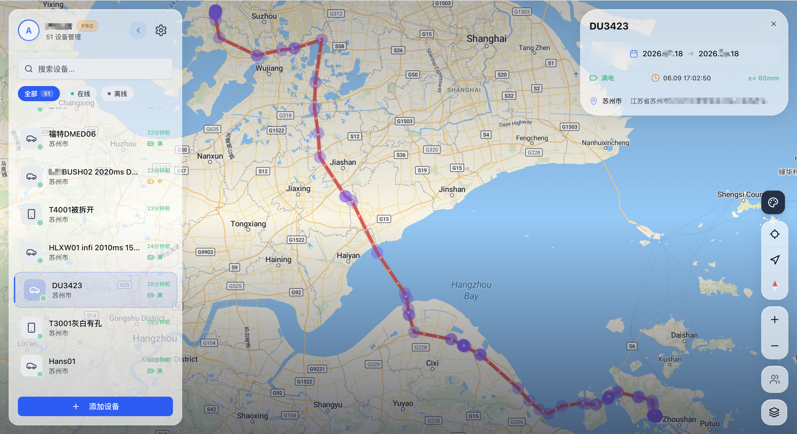
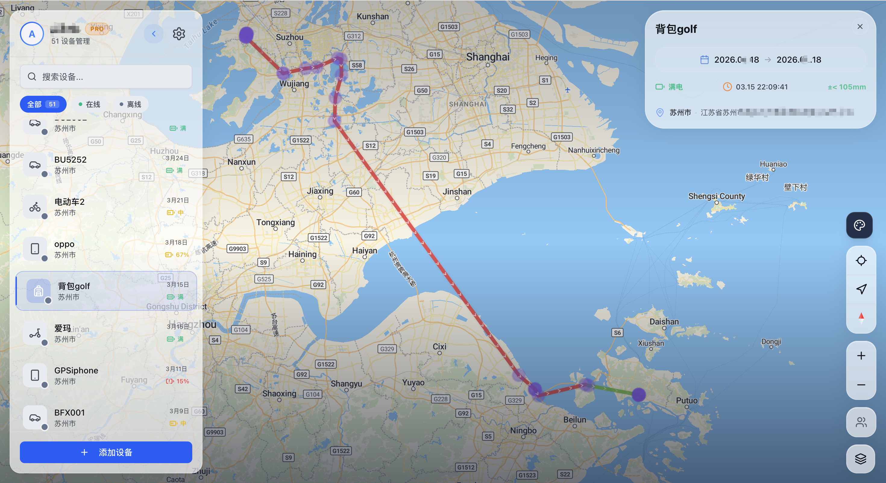
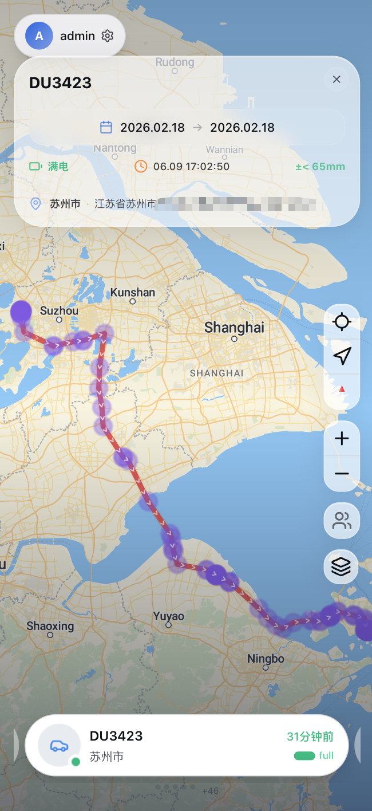
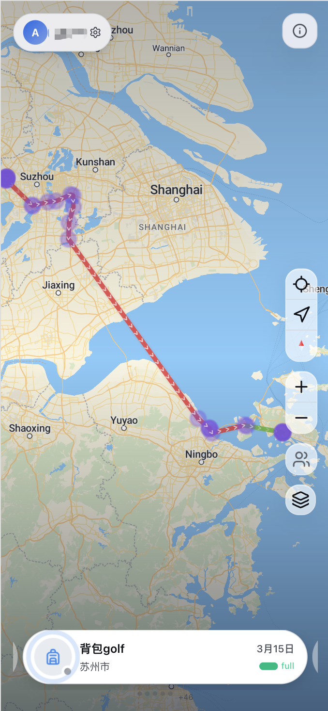
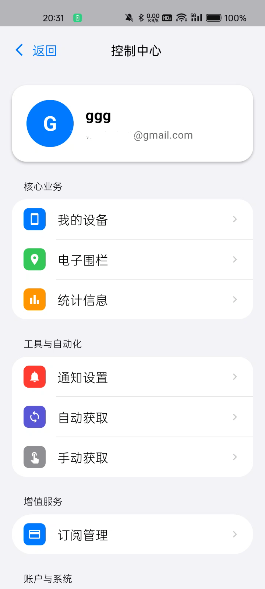
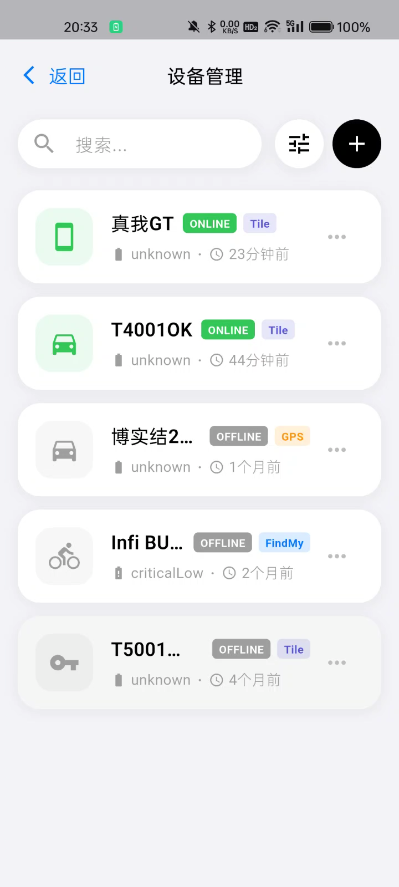
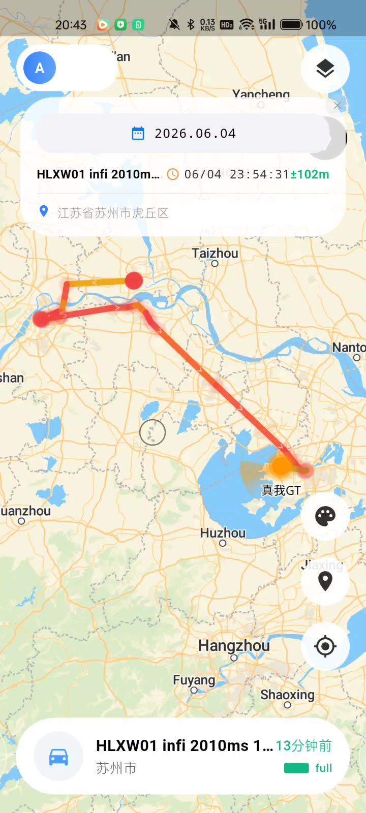
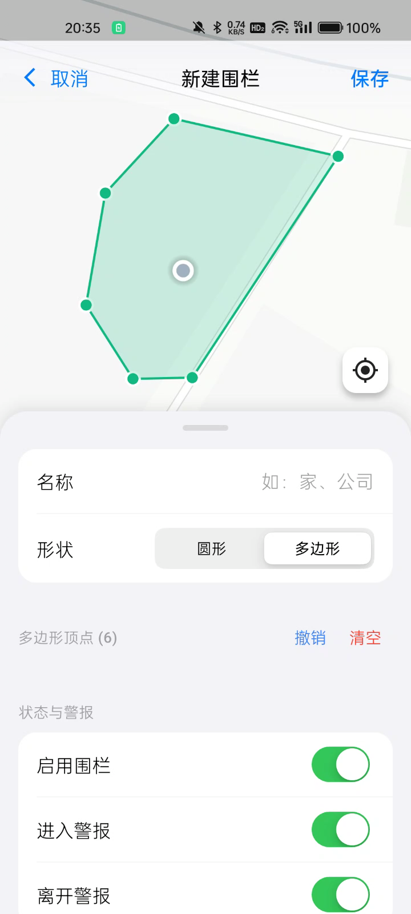
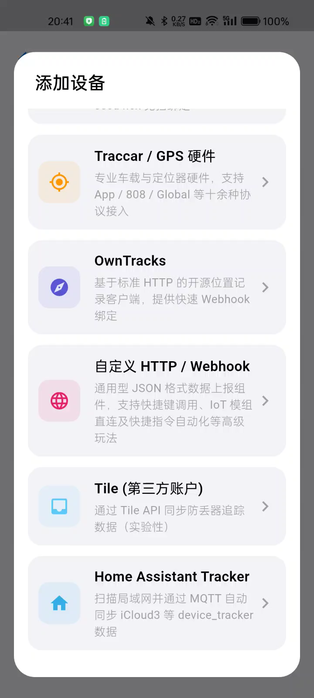
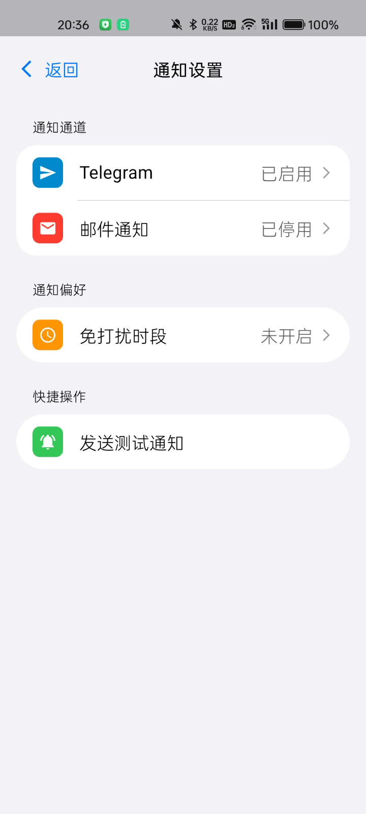

# AirTracer 🌐

[English](README_EN.md) | [日本語](README_JA.md) | **한국어** | [中文](README.md)

**AirTracer**는 Apple FindMy 네트워크(Macless 아키텍처) 및 다양한 GPS 데이터 소스를 기반으로 하는 현대적인 스마트 위치 추적 및 기기 관리 시스템입니다. 본 저장소는 AirTracer의 공식 퍼블릭 리포지토리로, 코어 클라이언트 소프트웨어(Android 애플리케이션 및 기기 펌웨어) 배포, 상세한 플랫폼 사용 가이드 제공, 그리고 맞춤형 솔루션 또는 자체 서버 구축(셀프 호스팅)을 희망하는 사용자를 위한 엔터프라이즈급 프라이빗 프로젝트 **Tracer**의 소개를 담고 있습니다.

🌐 **공식 온라인 체험 플랫폼**: [https://airtracer.us](https://airtracer.us)

---

## 🎨 인터페이스 미리보기

### 💻 PC 웹 버전 (Desktop Web)
| **PC 버전 InfiTag 컨트롤 센터** | **PC 버전 LoopTag 궤적 상세 정보** |
|:---:|:---:|
|  |  |
| *대화면 기반의 다차원 지도 위치 추적 및 대시보드* | *고정밀 이동 경로 궤적 라인 및 체류 지점 분석* |

---

### 📱 모바일 웹 및 앱 (Mobile Web & App)
| **InfiTag 모바일 앱** | **LoopTag 모바일 앱** |
|:---:|:---:|
|  |  |
| *동적 롤링 키: 실시간 연동, 끊김 없는 경로, 정밀한 추적* | *고정 키 모드: Apple 서버에 의해 차단되기 쉬워 위치 유실 가능성 높음* |

| **컨트롤 센터 (모바일)** | **기기 관리 (모바일)** |
|:---:|:---:|
|  |  |
| *모바일 화면에서 여러 기기의 실시간 위치 모니터링* | *기기 상태 통합 모니터링 및 간편 설정* |

| **궤적 재생 및 분석** | **전자펜스 (지오펜스) 설정** |
|:---:|:---:|
|  |  |
| *고정밀 경로 렌더링 및 체류 지점 추출* | *사용자 정의 안전 영역 설정 및 스마트 경보 작동* |

| **Home Assistant 스마트홈 연동** | **알림 센터 및 설정** |
|:---:|:---:|
|  |  |
| *MQTT 자동 검색을 통해 코드 한 줄 없이 HA 엔티티로 자동 매핑* | *기기 경보 알림 수신 및 시스템 상세 설정* |

---

## 🚀 주요 특징

- 📡 **맥리스 (Macless) FindMy 추적**: Mac 하드웨어 게이트웨이를 따로 구매할 필요 없이, `anisette-v3` 프로토콜 스택과 스마트 스케줄러를 통해 Apple 서버에서 직접 위치 리포트를 실시간 동기화합니다.
- 🔄 **스마트 키 파생 알고리즘**: 고정 키를 사용하는 기존의 LoopTag 기기(Apple 서버에 의해 스팸 데이터로 분류되어 위치 정보가 차단되기 쉬움)와 달리, AirTracer는 InfiTag에 최적화된 **동적 롤링 키 알고리즘**을 탑재하였습니다. 독자적인 **스마트 워터폴 검색 전략**과 결합하여 한층 더 실시간에 가까운 위치, 고밀도 경로 포인트, 상세 궤적을 매우 정밀하게 수집합니다.
- 🏡 **Home Assistant 네이티브 연동**: MQTT Discovery 프로토콜 내장. 기기의 위치, 상태, 배터리 잔량이 Home Assistant 내부의 `device_tracker` 및 `sensor` 엔티티로 자동 매핑됩니다. **철저한 다중 사용자 보안 격리** 지원.
- 🗺️ **고정밀 궤적 및 지오펜스 분석**: Leaflet 및 Amap(고덕지도) 엔진 탑재. 이동 경로 동적 재생, 히트맵 렌더링, 체류 지점 추출, 주행 속도 분석, 지오펜스 경보 시스템을 지원합니다.
- 🔔 **멀티채널 경보 즉시 알림**: 지오펜스 진입/이탈, 배터리 부족 등의 이벤트 발생 시 Telegram Bot 또는 웹 푸시 알림을 통해 즉시 수신할 수 있습니다.

---

## 📦 소프트웨어 릴리스 및 다운로드

사전 빌드된 펌웨어와 모바일 앱은 [Releases](../../releases) 페이지에서 제공됩니다.

### 1. Android 클라이언트 (APK)
- **AirTracer Android 앱**: 바탕화면 위젯, 백그라운드 위치 보고, 실시간 지도 뷰어, 경보 알림을 완벽하게 지원하는 모바일 특화 앱.
- 👉 [최신 APK 다운로드](../../releases/latest) (GitHub Releases)

### 2. 하드웨어 펌웨어 (Firmware)
- **InfiTag (무극)**: **【추천】** 동적 롤링 키 메커니즘을 기반으로 작동하여 실시간 위치 정확도를 극대화하고 위치 데이터 유실을 방지합니다. nRF51822 칩을 지원합니다.
- **LoopTag**: 기존 고정 퍼블릭 키(Fixed Key) 방식으로 작동합니다. 간단한 테스트나 낮은 주기의 위치 조회에 적합합니다 (주의: 고정 키 모드는 Apple 서버에 의해 일부 위치 리포트가 누락될 수 있습니다). nRF52810/nRF52832를 지원합니다.
- 👉 [펌웨어 패키지 다운로드](../../releases/latest)

---

## 📚 관련 문서

빠른 시작을 돕는 유용한 분류 가이드:

- 📖 **[사용자 가이드](docs/user_guide.md)**: 회원가입, 로그인, GPS/FindMy 기기 추가, 지오펜스 생성, Telegram Bot 연동 프로세스.
- 🔌 **[펌웨어 쓰기 및 하드웨어 가이드](docs/firmware_guide.md)**: 하드웨어 배선도, 업로드 툴(OpenOCD/J-Flash/PyOCD), Makefile 컴파일 변수, 시드(Seed) 키 파생 알고리즘 설명.
- 🏠 **[Home Assistant 연동 가이드](docs/home_assistant.md)**: MQTT Broker 연결 설정, 사용자 격리 계정 적용, 기기 트래커 자동 추가 프로세스.

---

## 💎 프라이빗 프로젝트 Tracer 상용 버전 도입 안내

AirTracer의 검증된 성능을 바탕으로 **개인 또는 비즈니스 서버에 셀프 호스팅으로 도입**하거나, **비즈니스 목적의 대규모 위치 추적 시스템을 구축**하고자 하는 경우, 한층 강력해진 프라이빗 프로젝트 **Tracer** 상용 라이선스를 제공합니다.

### 🌟 프라이빗 Tracer 상용 버전의 차별화된 강점:
1. **완벽한 자체 서버(Self-Hosted) 환경**: FastAPI + PostgreSQL + TimescaleDB + Redis + Mosquitto로 이루어진 모든 인프라를 Docker-compose 클릭 한 번으로 신속 배포 가능.
2. **대용량 시계열 데이터 최적화**: 수백 대 이상의 기기에서 발생하는 고주파 위치 트래픽을 지연 없이 저장하기 위해 고도로 최적화된 TimescaleDB 스키마.
3. **기업형 권한 제어 (RBAC)**: 세분화된 역할 기반 권한 제어, 서브 계정 기능, 완벽한 멀티테넌시 격리 설계.
4. **독자 브랜드 구축 (OEM)**: 전용 앱 명칭, 로고, 메인 테마 색상, 개인 도메인 설정, 독립적인 지도 라이선스 통합.
5. **전용 하드웨어 설계 서비스**: 회로설계부터 맞춤형 블루투스 펌웨어(초저가 국산 SoC인 ST17H66B 포팅 지원 포함) 개발까지 종합 서비스 제공.

### 📞 문의하기
자체 서버 구축, 전용 하드웨어, 비즈니스 라이선스에 대해 관심이 있으신 분은 아래 채널로 문의해 주시기 바랍니다:
- 📧 **이메일**: [airtagtracer@gmail.com](mailto:airtagtracer@gmail.com)
- 💬 **Telegram**: [@AirTracer](https://t.me/AirTracer)

*개인 서버 구축, 기기 맞춤형 개발, 기업용 라이선스 등 구체적인 니즈를 간략히 정리하여 보내주시면 24시간 이내에 답변해 드리겠습니다.*
