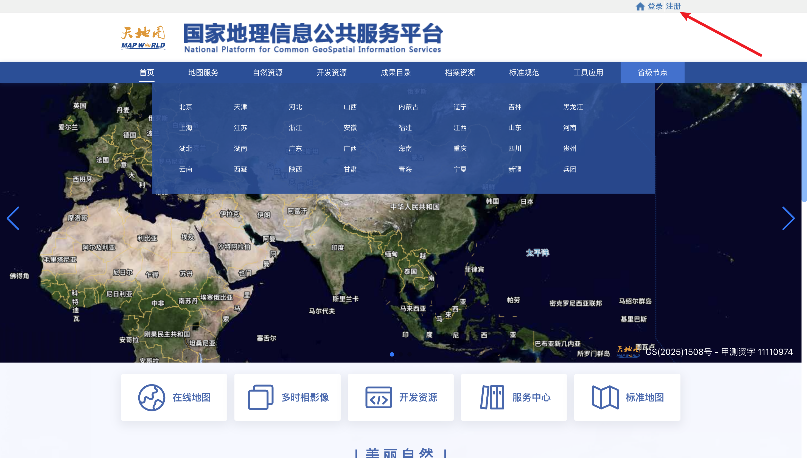
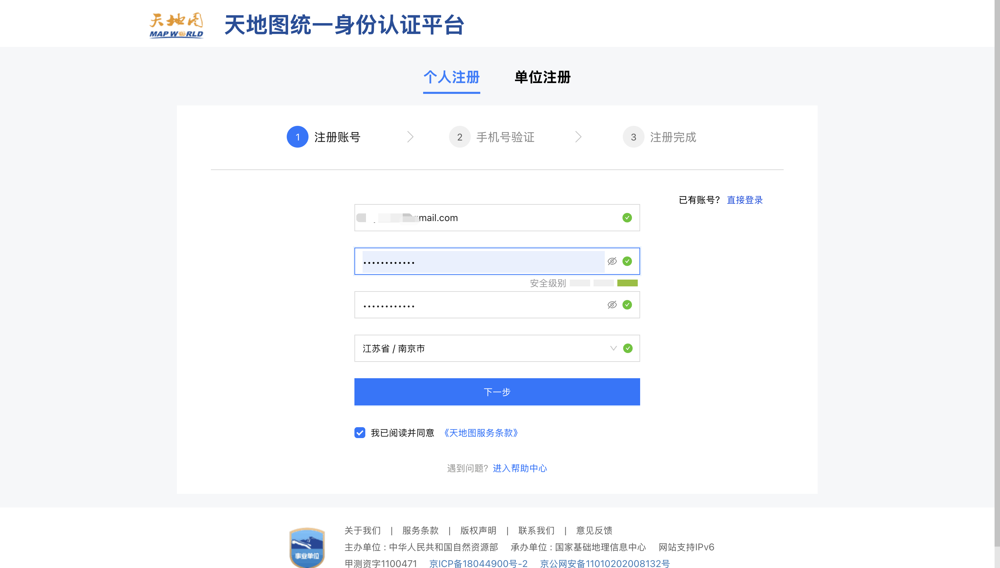
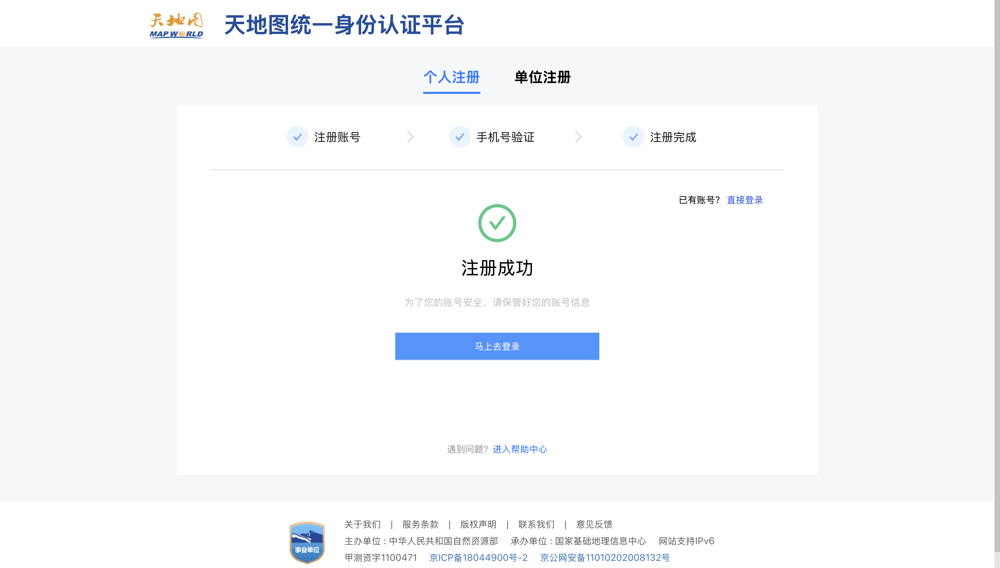
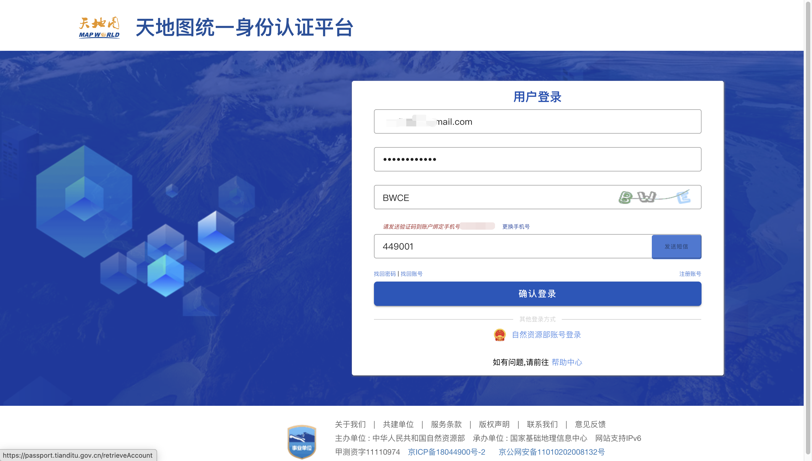
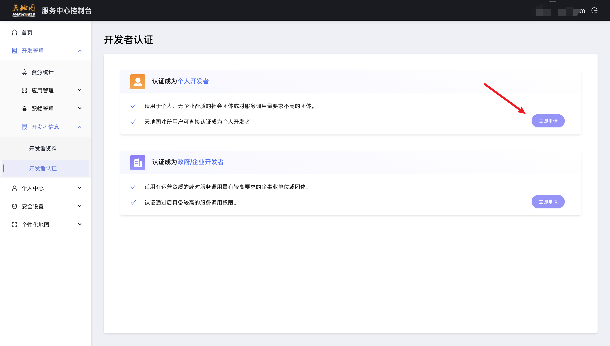
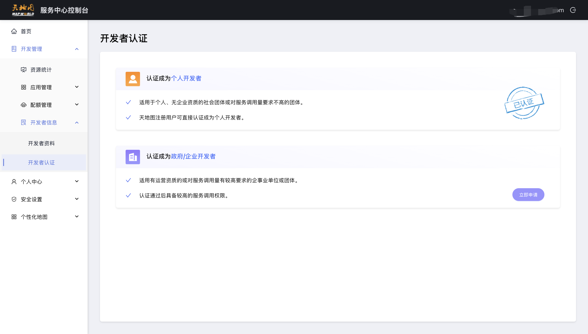
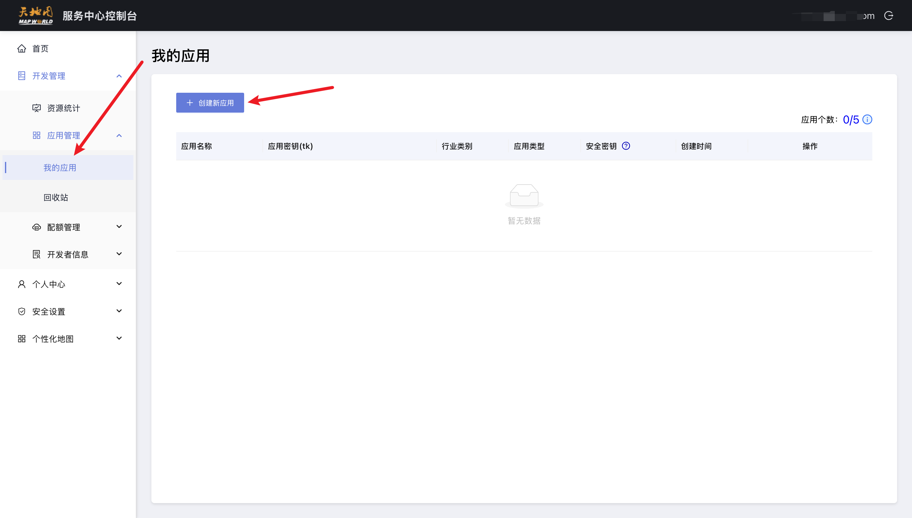
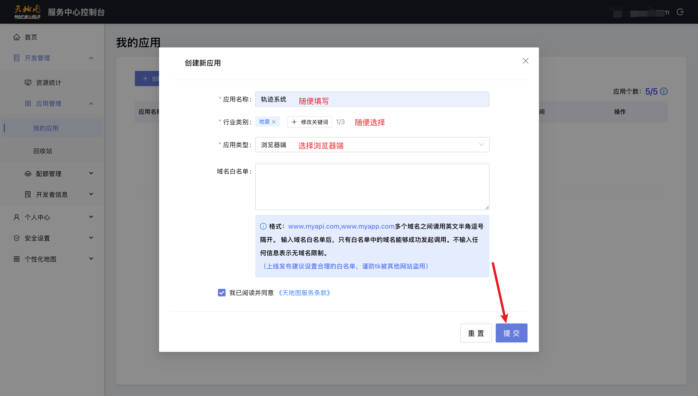
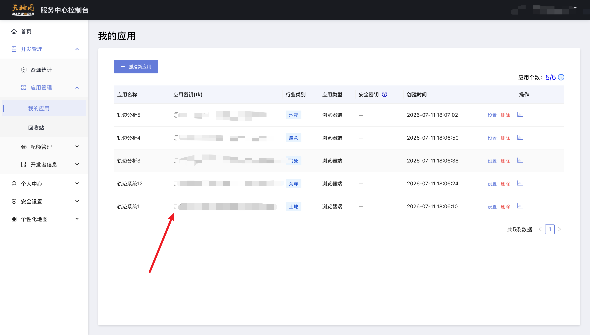
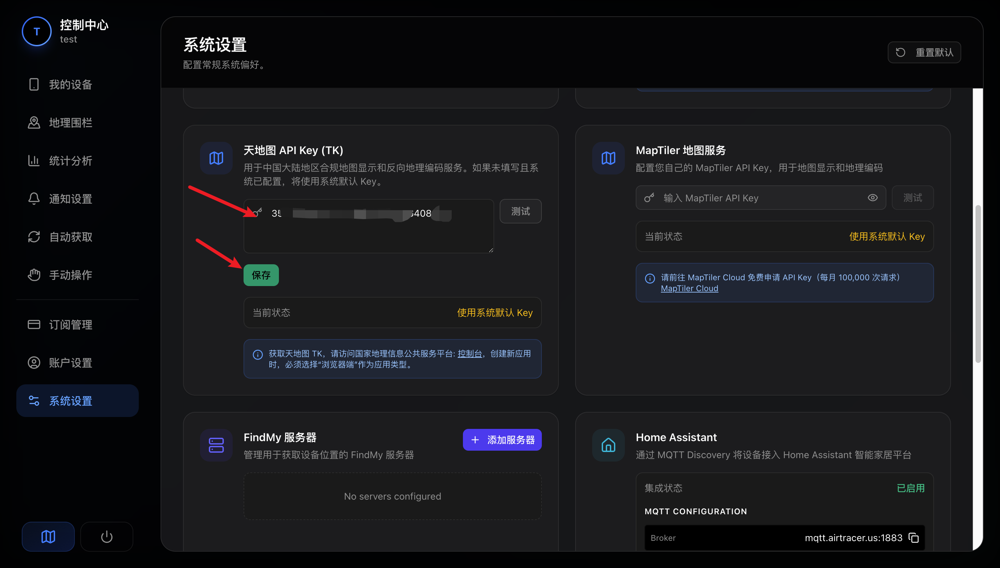

# 天地图 API Key 申请教程

因为公共的天地图账户使用人数较多，每天的调用限制很快就会被触发，导致大家在 Android 端无法正常显示地图。为了保证您能够稳定、流畅地看到地图，建议您自己免费申请一个天地图的 API Key（密钥）。

使用自己的天地图 Key 完全不会出现地图加载不出来的情况！整个申请过程非常简单，专门为小白编写，大约只需要 3-5 分钟。

> [!TIP]
> **强烈建议**：请使用**电脑浏览器**进行操作，申请过程会更加方便快捷。

## 第一步：注册并登录天地图

1. 使用电脑打开浏览器，访问 **[国家地理信息公共服务平台（天地图）官网](https://www.tianditu.gov.cn/)**。
2. 点击页面右上角的 **“注册”**。

3. 按照提示填写注册信息（如用户名、密码、手机号等）。

4. 完成注册。

5. 注册完成后，返回首页点击右上角的 **“登录”**，使用刚才注册的账号登录。

## 第二步：完成开发者认证

为了正常调用天地图的接口，您需要完成开发者认证。

1. 登录成功后，进入控制台或点击个人中心，找到 **“开发者认证”**。

2. 按照页面要求选择“个人开发者”，并填写相关信息完成认证。通常认证是非常快的。

## 第三步：创建新应用

要想获取 Key，首先得建一个“应用”来存放这个 Key。

1. 在控制台左侧的菜单栏中，找到应用管理相关选项，点击 **“创建新应用”**。

2. 在弹出的页面中填写应用的基本信息：
   - **应用名称**：随便起一个容易记住的名字，比如“我的追踪器”、“测试应用”等。
   - **行业分类**：根据实际情况选择即可。
   - **应用类型**：请选择 **浏览器端**（请务必按照图片所示选择，不要选 Android 端）。
   - 按图片提示填写相关说明信息。

## 第四步：获取并使用你的 API Key

1. 提交成功后，在应用列表中就可以看到你刚刚创建的应用了。
2. 里面包含一串重要的信息：**Key**（密钥）。
3. 复制这串密钥。

4. 将复制好的 Key 填入我们系统的设置中并保存！这样你的 Android 端就可以稳定地看地图啦。

---

> [!IMPORTANT]
> ### ⚠️ 重要注意事项
> 
> 1. **妥善保管**：千万不要把你的 Key 发给陌生人，以免被别人盗刷你的额度。
> 2. **免费额度**：天地图对个人开发者每天都提供了一定数量的免费调用额度，对于日常个人使用来说完全足够了，不用担心收费问题。
