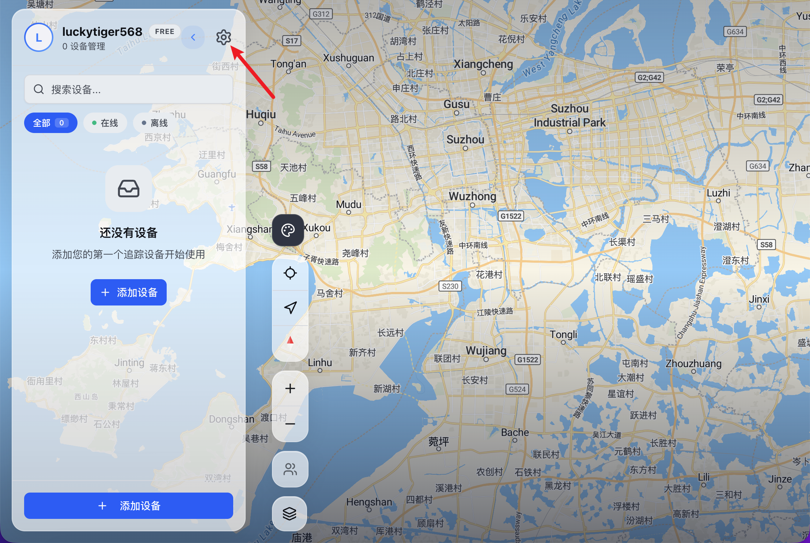
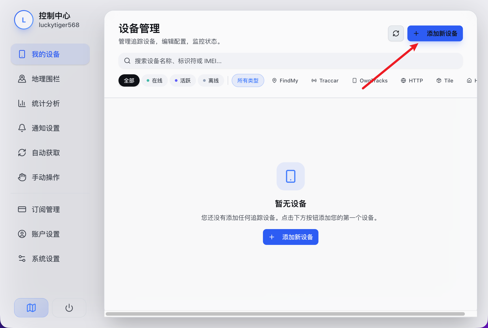
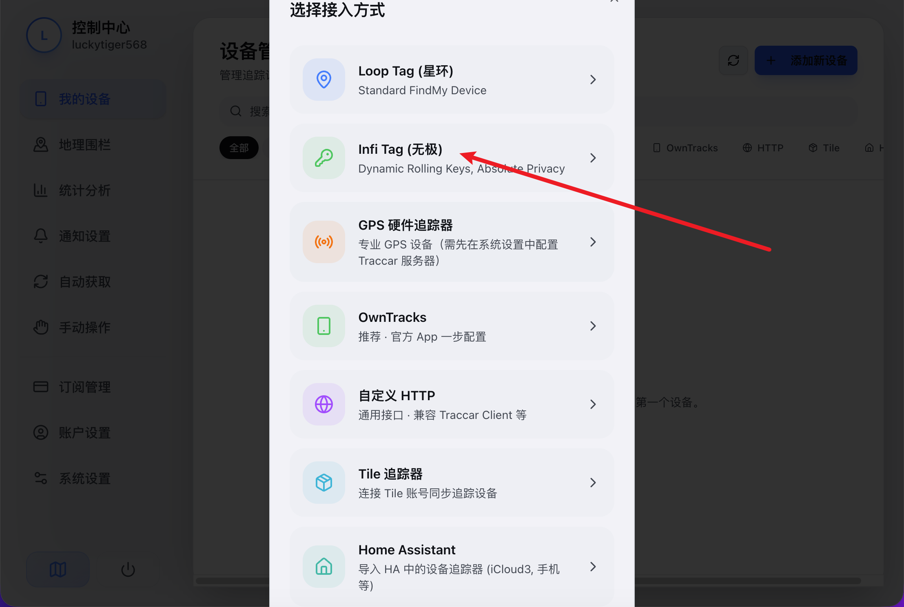
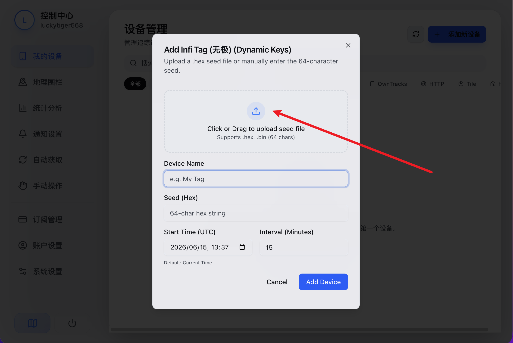
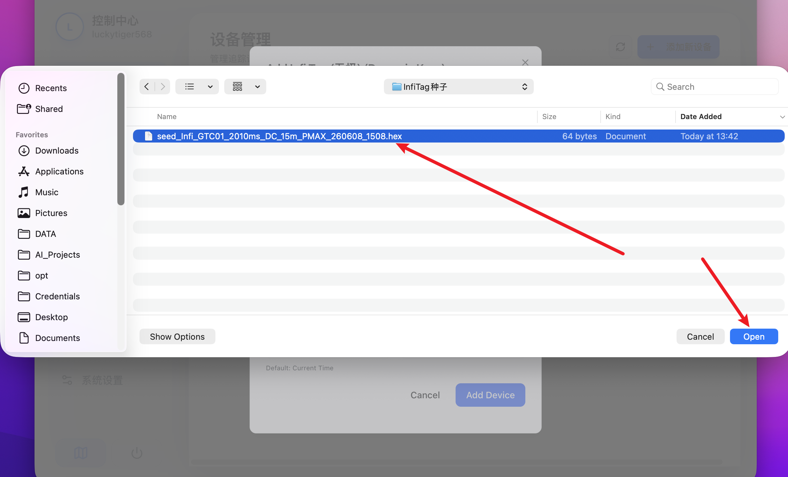
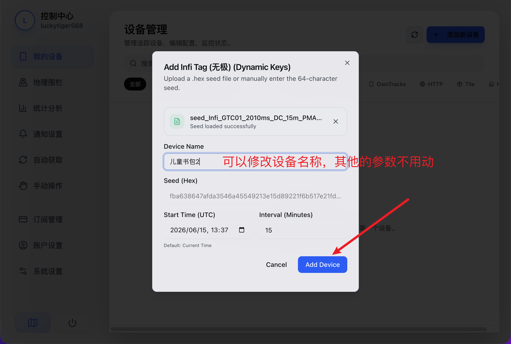
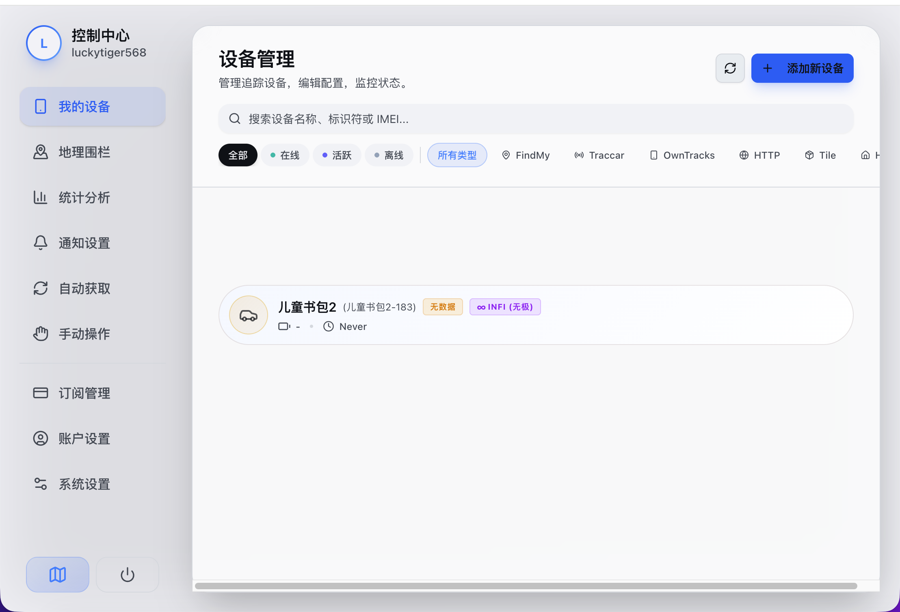

# 添加设备教程

欢迎使用 AirTracer！在完成账号注册后，本教程将教你如何添加你的第一个防丢器设备。

## 添加 Infi Tag 设备 (保姆级图文)

Infi Tag (无极) 是我们推荐的防屏蔽、高精度定位标签。准备好你获取设备时收到的 **.hex 格式种子文件**，我们开始添加：

### 1. 进入控制中心
在地图页面的左上方，找到你的用户名，点击旁边的 **设置（齿轮）图标**，进入控制中心。

### 2. 点击“我的设备”
进入控制中心后，在左侧菜单栏中点击 **“我的设备”**。

### 3. 点击“添加新设备”
在页面右上方，点击蓝色的 **[+ 添加新设备]** 按钮。

### 4. 选择接入方式为“Infi Tag”
在弹出的包含多个选项的窗口中，选择 **“Infi Tag (无极)”**。

### 5. 上传或填写设备种子文件
接下来会看到设备参数设置弹窗。点击中间虚线框内的 **上传图标**（Click or Drag to upload seed file）。

> [!TIP]
> 除了上传 `.hex` 种子文件之外，你也可以选择直接在下方的 **Seed (HEX)** 输入框中，填写我们提供给你的十六进制种子密钥。

### 6. 选择你的 .hex 文件 (若采用上传方式)
若你选择上传文件，此时会打开电脑的文件选择窗口。找到你提前保存好的 `.hex` 结尾的种子文件，选中它，然后点击 **“打开 (Open)”**。

### 7. 填写设备名称并添加
种子上传或填写成功后，你可以修改设备的名称（例如：儿童书包2），**其他的参数不用动**。确认无误后，点击底部的 **Add Device (添加设备)** 按钮。

### 8. 完成设备添加
设备成功添加后，即可在设备列表中看到它！

---

## 补充视频教程

- **iPhone 节点设置演示：**
  若需要将 iPhone 设置为应用节点，可参考下方动画演示：
  
