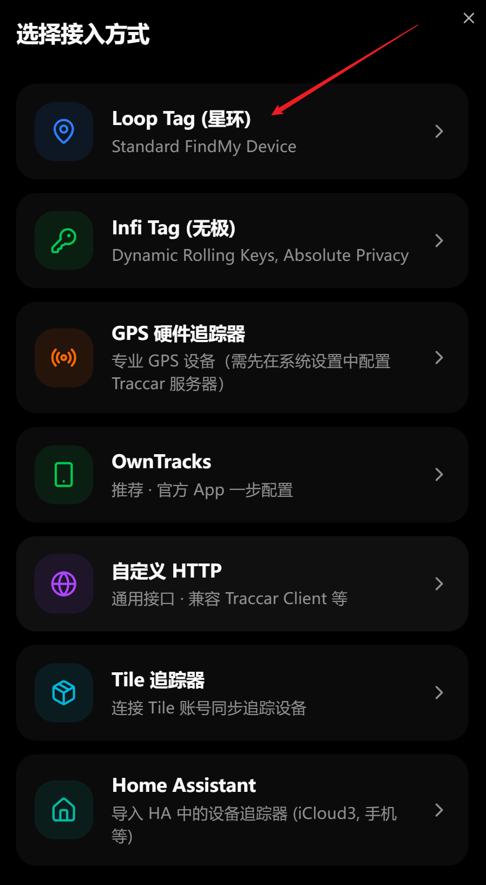
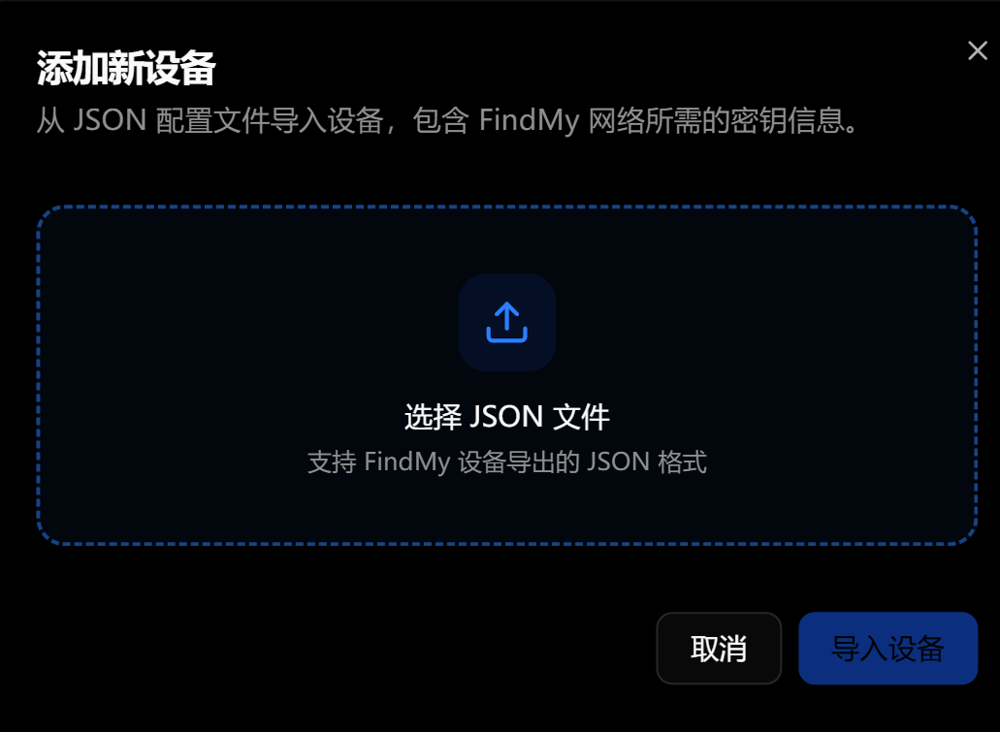
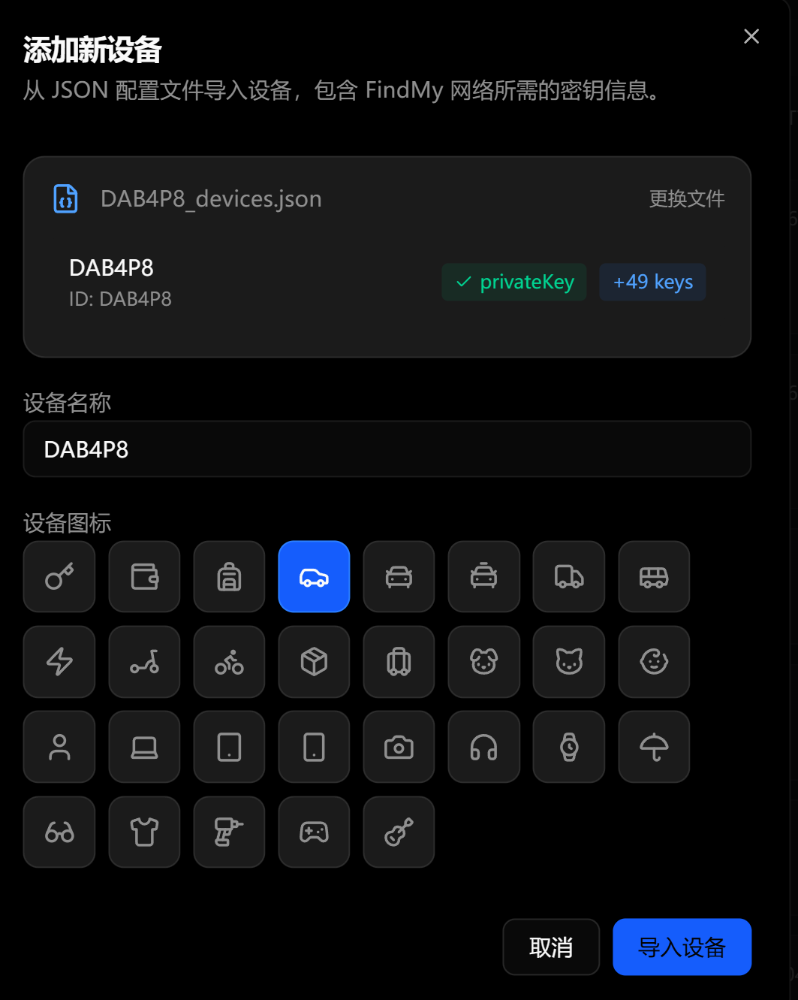
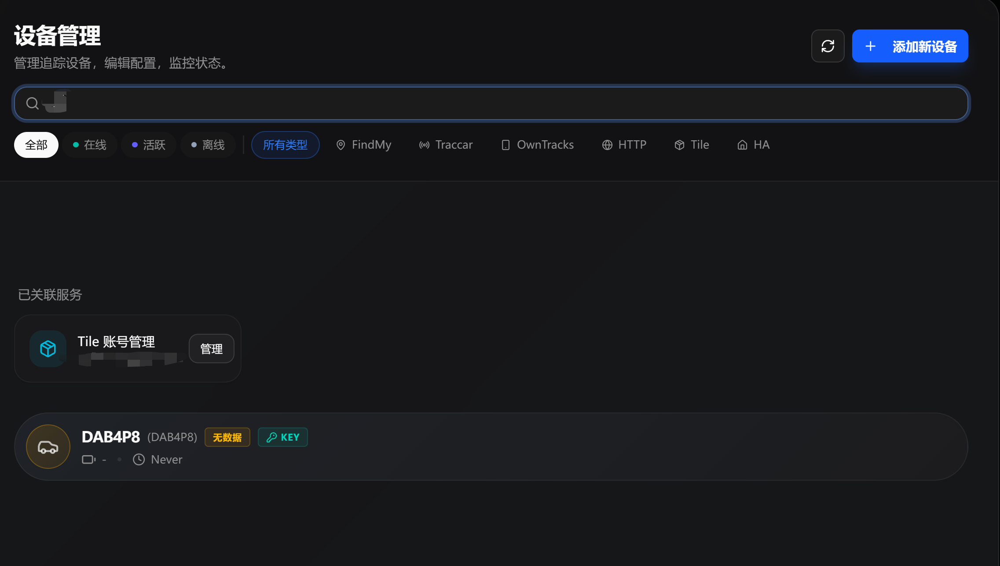

# 添加 Loop Tag (星环) 设备教程

本教程将教你如何添加基于开源项目制作的 AirTag（在系统中我们称为 **Loop Tag (星环)**）。

> [!WARNING]
> **关于 Loop Tag 的限制**
> Loop Tag (星环) 只有固定数量的 key。如果经常使用，会被苹果设备判定并丢弃数据，导致位置不更新。因此，它的体验没有我们的 **Infi Tag (无极)** 好用。如果你追求高精度和防屏蔽，强烈建议使用 Infi Tag。

## 添加步骤

### 1. 选择接入方式为“Loop Tag (星环)”
在控制中心的“我的设备”页面点击“添加新设备”，然后在弹出的选择接入方式窗口中，点击 **“Loop Tag (星环)”** (Standard FindMy Device)。

### 2. 选择设备的 JSON 文件
在弹出的导入窗口中，点击中间的 **“选择 JSON 文件”** 上传区域，找到并选择你的 Loop Tag 设备导出的 **JSON 格式配置文件**（该文件包含 FindMy 网络所需的密钥信息）。

### 3. 配置设备信息
文件上传成功后，系统会自动解析出密钥信息（如 privateKey 和包含的 key 数量，例如 +49 keys）。
在这里，你可以自定义 **设备名称**（例如：DAB4P8），并在下方选择一个合适的 **设备图标**（如汽车、钥匙、背包等）。确认无误后，点击右下角的 **“导入设备”** 按钮。

### 4. 完成设备添加
导入完成后，返回设备管理页面，你就可以在设备列表中看到刚刚添加的 Loop Tag 设备了！设备将会开始接收位置更新。

