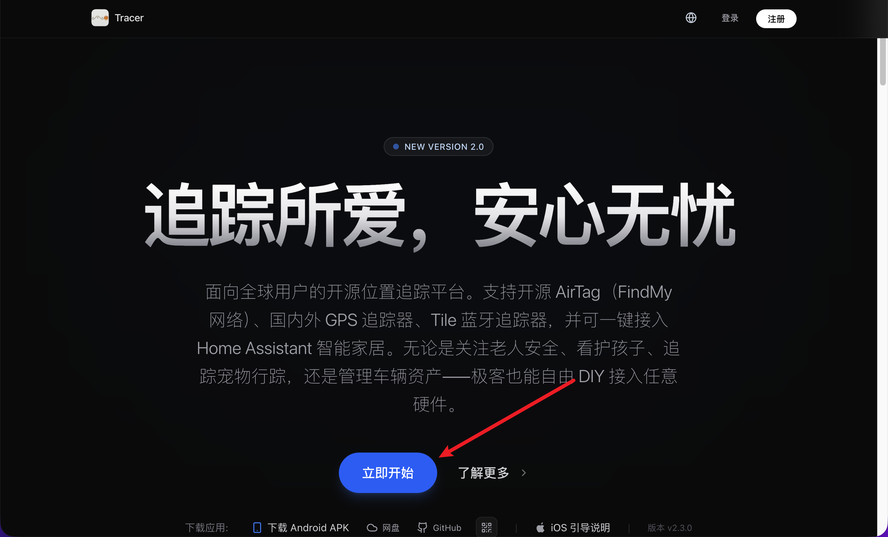
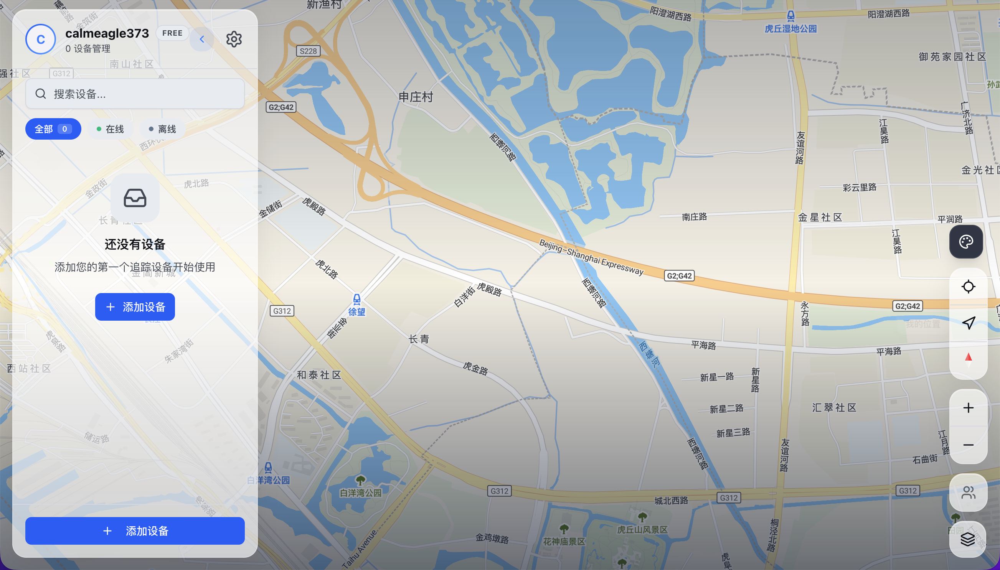

# 注册账号与登录教程

欢迎使用 AirTracer！本教程将通过图文结合的方式，教你如何注册账号并登录系统。

## 步骤一：打开平台与注册账号
在浏览器（推荐使用 Chrome 或 Edge）中访问官方在线平台 [https://airtracer.us](https://airtracer.us)，进入登录页面，找到并点击 **注册 (Register)**。

填写你的邮箱并设置一个密码，完成账号创建。

## 步骤二：登录系统
注册完成后，返回登录界面，输入刚刚注册的邮箱和密码。

点击登录即可进入 **地图页面**。

> [!TIP]
> 登录后首先看到的是地图页面，你可以在这里直观地看到所有设备所在的地理位置。

---

## 补充视频教程

- **注册账号演示：**
  若对文字有疑问，可直接观看下方动画演示：
  
